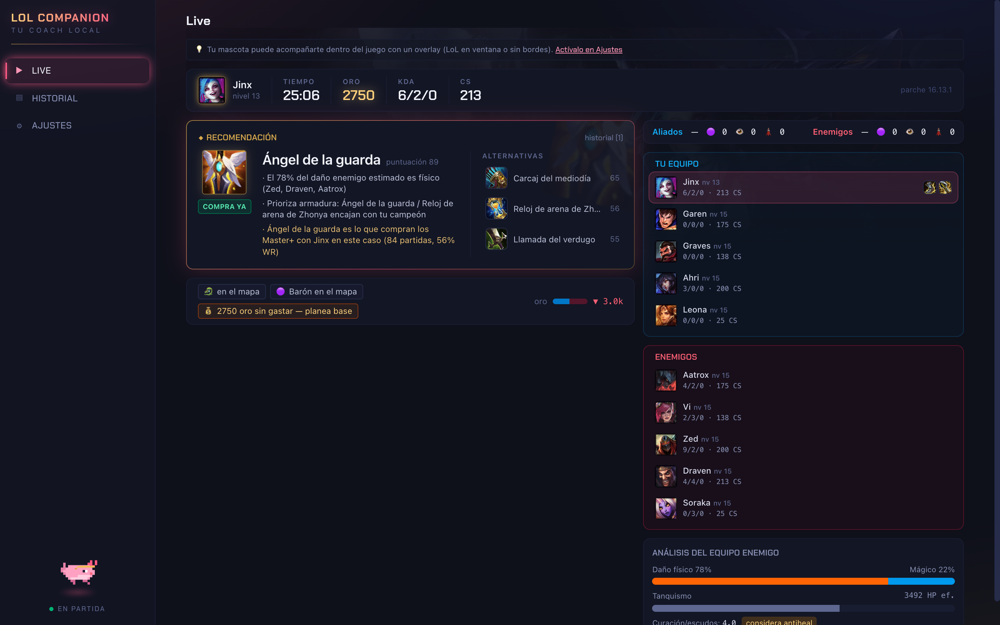
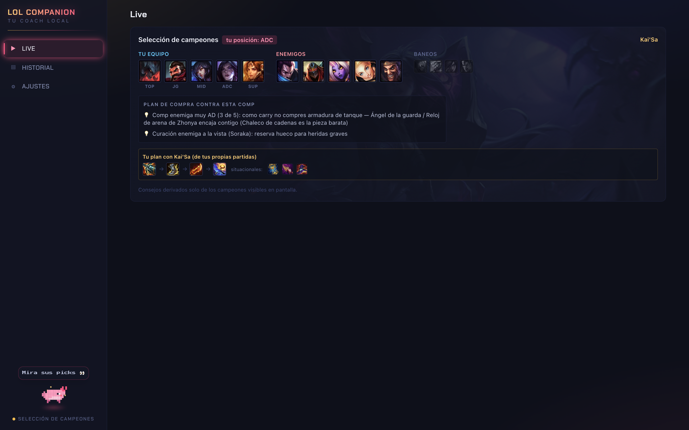

# LoL Companion

Local-first desktop companion for League of Legends (Electron + TypeScript). Reads your own live game (Live Client Data API), champ select (LCU) and match history (Riot API) to produce explained, context-aware build recommendations — driven primarily by Master+ match data, with a personal AI coach mascot.

**Download:** grab the latest installer from [Releases](https://github.com/carlo23666/lolcompanion/releases) (per-user setup, no admin needed). Set your Riot API key in Ajustes on first run.

## Screenshots

In-game: explained recommendations (every advice carries its reasons), Master+-backed picks, enemy comp analysis and objective tracking:

Champ select: buy plan against the enemy comp plus your personal plan for the hovered champion — derived only from what's visible on screen:

- Start here: `CLAUDE.md` (agent instructions) → `docs/architecture.md` → `backlog/README.md`
- Full research/plan: `docs/architecture.md` (condensed) — original study kept by owner.
- Workflow: `docs/review-process.md`

## License

[PolyForm Noncommercial 1.0.0](LICENSE) — you may read, use, modify and share this software **for noncommercial purposes only**. All commercial rights are reserved by the copyright holder. If you want a commercial license, open an issue.

By contributing you agree that your contributions are licensed under the same terms and that the copyright holder may relicense the project (including commercially).

## Legal

LoL Companion isn't endorsed by Riot Games and doesn't reflect the views or opinions of Riot Games or anyone officially involved in producing or managing Riot Games properties. Riot Games, and all associated properties are trademarks or registered trademarks of Riot Games, Inc.

This tool only uses Riot-approved data sources (Live Client Data API, LCU, Riot Web API, Data Dragon) and follows Riot's third-party tool policies — no enemy cooldown tracking, no de-anonymization, no memory reading.
