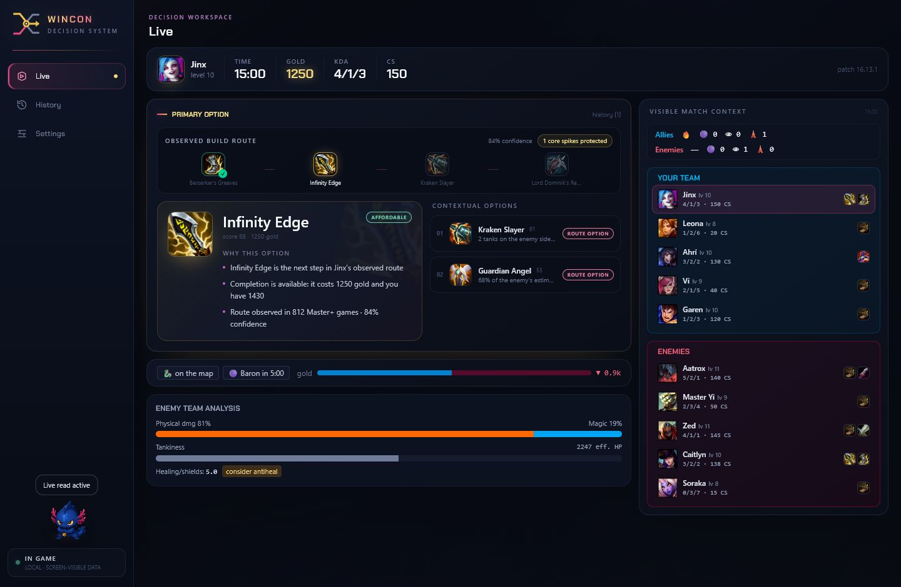
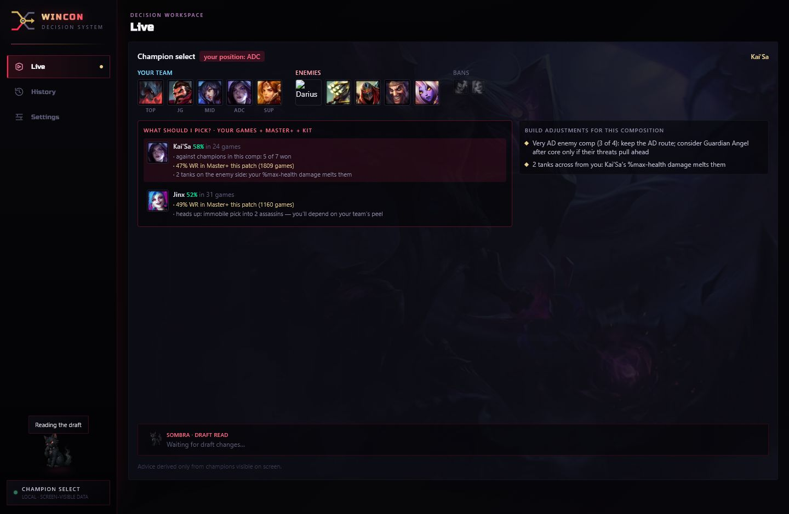

# WinCon

Local-first decision system for League of Legends (Electron + TypeScript). Reads your own live game (Live Client Data API), champ select (LCU) and match history (Riot API) to produce explained, context-aware build recommendations — driven primarily by Master+ match data, with a themed companion.

**Website:** [carlo23666.github.io/lolcompanion](https://carlo23666.github.io/lolcompanion/) · **Download:** grab the latest installer from [Releases](https://github.com/carlo23666/lolcompanion/releases) (per-user setup, no admin needed). Live local features require no API key; history sync is configured separately for private/development use.

**Current release:** 1.6.0 — core-first build routes, Rift/Dark/Sakura identities, a movable and
scalable overlay with item-rich purchase advice, and conservative visible-material fight windows.

## Screenshots

In-game: explained recommendations (every advice carries its reasons), Master+-backed picks, enemy comp analysis and objective tracking:

Champ select: buy plan against the enemy comp plus your personal plan for the hovered champion — derived only from what's visible on screen:

Overlay purchase advice carries typed item data, so the matching icon and localized name can be
shown without parsing generated text. Fight hints use only visible level, health, items, CS and KDA;
they never infer hidden gold, cooldowns, fog or incoming help.

- Start here: `CLAUDE.md` (agent instructions) → `docs/architecture.md` → `backlog/README.md`
- Full research/plan: `docs/architecture.md` (condensed) — original study kept by owner.
- Workflow: `docs/review-process.md`

## License

[PolyForm Noncommercial 1.0.0](LICENSE) — you may read, use, modify and share this software **for noncommercial purposes only**. All commercial rights are reserved by the copyright holder. If you want a commercial license, open an issue.

By contributing you agree that your contributions are licensed under the same terms and that the copyright holder may relicense the project (including commercially).

## Legal

WinCon isn't endorsed by Riot Games and doesn't reflect the views or opinions of Riot Games or anyone officially involved in producing or managing Riot Games properties. Riot Games, and all associated properties are trademarks or registered trademarks of Riot Games, Inc.

This tool uses the documented Live Client Data API, Riot Web API and Data Dragon plus an isolated local LCU integration for champ select. LCU is unsupported by Riot and can change. The project enforces screen-visible live inputs, no enemy cooldown tracking, no de-anonymization and no memory or packet access. Public distribution still requires Riot product registration and an appropriate production API key for history sync.
